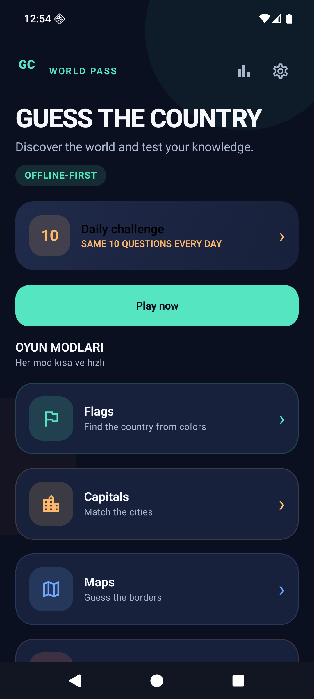
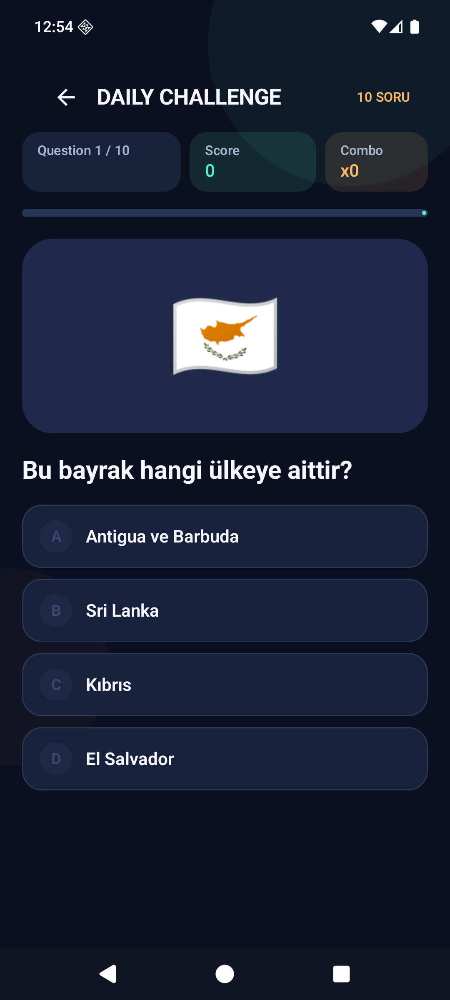
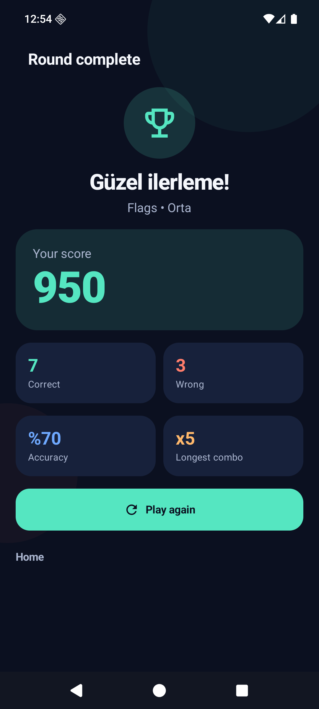

# Guess the Country

Modern, hızlı ve tamamen offline çalışan Android bilgi yarışması oyunu. Tek elle oynanabilir, kısa oturumlara uygundur ve 195 ülke kaydıyla genişletilebilir.

[](https://developer.android.com/)
[](https://kotlinlang.org/)
[](LICENSE)

## Screenshots

| Ana menü | Oyun ekranı | Sonuç |
| --- | --- | --- |
|  |  |  |

## Download APK

- [GitHub Releases](https://github.com/ozanstn1-stack/guess-the-country-android/releases)
- [v1.0.0 release sayfası](https://github.com/ozanstn1-stack/guess-the-country-android/releases/tag/v1.0.0)
- [Download signed release APK](https://github.com/ozanstn1-stack/guess-the-country-android/releases/download/v1.0.0/app-release.apk)
- [Download debug APK](https://github.com/ozanstn1-stack/guess-the-country-android/releases/download/v1.0.0/app-debug.apk)
- Debug APK, Android 8.0 (API 26) ve üzeri cihazlara kurulabilir.
- Android'de `Dosyalar` uygulamasından APK'yı açıp yükleme izni verin.

## Features

- 10 soruluk, hızlı oturumlar
- Rastgele ve aynı turda tekrarsız sorular
- Doğru cevapta yeşil geri bildirim, scale animasyonu ve confetti
- Yanlış cevapta kırmızı geri bildirim, doğru cevap vurgusu ve otomatik ilerleme
- 100 / 125 / 150 / 175 / 200 puanlık combo sistemi
- Kolay, Orta ve Zor ilerleme seviyeleri
- DataStore ile cihazda kalıcı puan, combo, istatistik ve ayarlar
- Günlük challenge için tarih tabanlı deterministic seed
- Sistem sesi ve haptik geri bildirimi, ayrılabilir ayarlar
- Type-safe JSON veri kaynağı ve fallback veri seti
- Offline çalışma; uygulama internet izni istemez

## Game modes

- **Bayraklar:** Ülke bayrağı emoji'sinden ülkeyi seç.
- **Başkentler:** Ülkenin başkentini seç.
- **Haritalar:** Sadeleştirilmiş yerel harita illüstrasyonundan ülkeyi seç.
- **Ünlü Yerler:** Editoryal landmark verisinden ülkeyi seç.
- **Para Birimleri:** Ülkenin para birimini seç.

## Tech stack

- Kotlin 2.2.20
- Android Gradle Plugin 8.13.0
- Gradle Wrapper 8.14.3
- Jetpack Compose + Material 3
- Compose BOM 2025.09.00
- Navigation Compose
- ViewModel + StateFlow + Kotlin Coroutines
- Preferences DataStore
- kotlinx.serialization JSON
- JUnit 4 and Compose UI tests
- compile/target SDK 36, min SDK 26, Java/Kotlin target 17

## Architecture

```
app/src/main/java/com/guesscountry/game/
├── data/
│   ├── local/          JSON asset ve DataStore repository'leri
│   ├── model/          Country, Question, GameResult, Progress modelleri
│   └── repository/     CountryRepository
├── domain/
│   ├── generator/      QuestionGenerator
│   ├── model/          GameSessionConfig
│   └── usecase/        GameRules
├── navigation/         Navigation Compose route'ları
├── ui/                 Ekranlar, tema, yeniden kullanılabilir bileşenler
└── MainActivity.kt
```

`QuestionGenerator` veri kaynağından soru seed'leri üretir, zorluk ve mod filtresi uygular, aynı soru ID'lerini eler, üç yanlış seçenek kurar ve seed ile tekrarlanabilir daily challenge üretir. Oyun ViewModel'i puan, combo, geçiş ve sonucu yönetir; `PlayerRepository` sonuçları DataStore'a yazar.

## Installation

### Android Studio

1. Android Studio Ladybug veya üzeri açın.
2. `File > Open` ile bu klasörü seçin.
3. JDK 17 ve Android SDK 36 kurulu olduğundan emin olun.
4. Gradle sync tamamlandıktan sonra `app` modunu çalıştırın.

### CLI

```bash
git clone https://github.com/ozanstn1-stack/guess-the-country-android.git
cd guess-the-country-android
./gradlew assembleDebug
```

Windows PowerShell için:

```powershell
.\gradlew.bat assembleDebug
```

## Build and test

```bash
./gradlew testDebugUnitTest
./gradlew lintDebug
./gradlew assembleDebug
./gradlew assembleRelease
```

Android cihaz veya API 26+ emulator bağlıysa UI testleri:

```bash
./gradlew connectedDebugAndroidTest
```

`local.properties`, keystore dosyaları ve build çıktıları Git'e eklenmez. Release imzalı APK için proje kökünde Git-ignore edilen `keystore/keystore.properties` ve `storeFile` alanlarını sağlayın.

## Project structure

- `app/src/main/assets/countries.json`: 195 ülke kaydı, offline veri kaynağı
- `app/src/main/java/.../domain/generator/QuestionGenerator.kt`: test edilebilir soru üretimi
- `app/src/main/java/.../ui/game/GameViewModel.kt`: oyun state ve puanlama
- `app/src/main/java/.../data/local/PlayerRepository.kt`: kalıcı ilerleme
- `app/src/main/java/.../ui/navigation/AppNavHost.kt`: tüm ekran geçişleri
- `app/src/test`: oyun mantığı birim testleri
- `app/src/androidTest`: temel Compose navigation/UI testi
- `.github/workflows/android-build.yml`: test, lint ve APK artifact akışı

## Localization

İlk kaynak dili Türkçedir. `res/values/strings.xml` varsayılan kaynakları, `res/values-en/strings.xml` örnek İngilizce kaynakları ve `res/xml/locales_config.xml` dil yapılandırmasını içerir. Country JSON'daki `countryNameTr` alanı ülke adlarını domain verisinden ayırmak için kullanılır. Yeni bir dil eklemek için ilgili `values-xx/strings.xml` klasörünü eklemek yeterlidir.

## License and asset licenses

Uygulama kodu MIT lisanslıdır. Ülke veritabanı ve görseller için `LICENSE_NOTICES.md` dosyasını inceleyin:

- Uygulama kodu: MIT
- Country data: Open Database License (ODbL)
- Vektör görseller: bu proje için özgün illüstrasyonlar
- Fotoğraf, harita karosu veya telifli ses dosyası: dahil değildir

## Current scope

- Oyun modlarının tamamı aktif ve 10 soruluk tur üretiyor.
- Country JSON 195 ülke içeriyor; famous-place alanı 89 ülke için editoryal olarak dolduruldu.
- Harita modu, telifli harita karosu kullanmadan yerel sade vektör illüstrasyon kullanır.
- Online leaderboard, AdMob ve Firebase bu sürümde kapalıdır; ilerleme local high score olarak saklanır.
- Release imzası kullanıcıya ait keystore verilmediği için demo çıktısı unsigned olabilir; imzalama altyapısı hazırdır.

## Future improvements

- Daha fazla dil ve ülke sorusu
- Daha ayrıntılı SVG harita paketleri
- Oyun içi kategori rozetleri
- Play Games / Firebase leaderboard adaptörü
- İsteğe bağlı AdMob banner, interstitial ve rewarded adapter
- Cloud save ve cihazlar arası ilerleme

## Download and release

Release APK'ları GitHub Releases üzerinden sunulur. Kaynak, testler, CI ve lisans bildirimleri aynı repository üzerinde tutulur.

Built with AI-assisted development.
